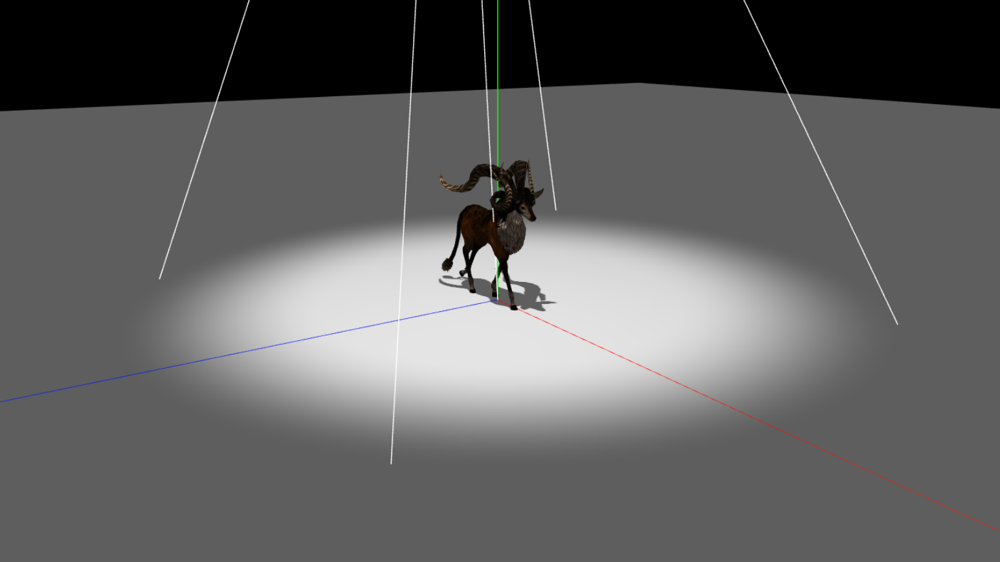

# Three.js Introduction

[](https://matheuxito.github.io/threejs-introduction/)

## Table of Contents

* [Author](#author)
* [Introduction](#introduction)
* [Requirements](#requirements)
* [How to Run](#how-to-run)
* [Tutorial](#tutorial)
  * [1. Importing Three.js](#1-importing-threejs)
  * [2. Setting up the scene](#2-setting-up-the-scene)
  * [3. Adding lights](#3-adding-lights)
  * [4. Importing a 3D model](#4-importing-a-3d-model)
    * [4.1. Importing the model](#41-importing-the-model)
    * [4.2. Adding animations](#42-adding-animations)
  * [5. Adding mechanics](#5-adding-mechanics)
    * [5.1. Moving the deer](#51-moving-the-deer)
    * [5.2. Spotting the deer with the light](#52-spotting-the-deer-with-the-light)
    * [5.3. Adding keyboard controls](#53-adding-keyboard-controls)
  * [6. Conclusion](#6-conclusion)
* [Credits](#credits)
* [License](#license)

## Author

- [Matheus Silva](https://www.github.com/matheuxito) | [LinkedIn](https://www.linkedin.com/in/matheuxito/)

## Introduction

This repository provides a simple introduction to Three.js, a popular JavaScript library for creating 3D graphics in the browser. Learn the basics of setting up a scene, adding lights, and importing 3D models from [Sketchfab](https://sketchfab.com/).


## Requirements

Before running this project, ensure you have a web server installed. You can choose between using `http-server` with npm (Node.js) or the built-in `http.server` module with Python.

### For Node.js Users

If you have Node.js installed, you can use `http-server` from npm. Install it globally using the following command:

```bash
npm install http-server -g
```

### For Python Users

If you have Python installed (which is likely already the case), you can use the built-in `http.server` module. No additional installation is required.

## How to Run

### 1. Clone the Repo

```bash
git clone https://github.com/matheuxito/threejs-introduction.git
```

### 2. Navigate to the Project Folder

```bash
cd threejs-introduction
```

### 3. Run the Web Server

#### 3.1. Using npm (Node.js)

```bash
# Start the server using npm and http-server
http-server
```

#### 3.2. Using Python

```bash
# Start the server using Python
python -m http.server -b localhost 8080
```

This will initiate a web server. Access the project by opening your browser and navigating to `http://localhost:8080` or another port specified in the terminal.

## Tutorial

### 1. Importing Three.js

**index.html**
```html
<script type="importmap">
  {
    "imports": {
      "three": "https://unpkg.com/three@0.139.2/build/three.module.js",
      "three/addons/": "https://unpkg.com/three@0.139.2/examples/jsm/"
    }
  }
</script>
```

The `importmap` tag is a new feature of the web platform that allows you to import modules from external sources. In this case, we are importing the Three.js library from [unpkg](https://unpkg.com/).

**index.js**
```js
import * as THREE from 'three';
import { OrbitControls } from 'three/addons/controls/OrbitControls.js';
import { GLTFLoader } from 'three/addons/loaders/GLTFLoader.js';
```
`three` is the main library, `OrbitControls` is a helper for the camera, and `GLTFLoader` is tool for loading 3D models.

### 2. Setting up the scene

First, we need to create a scene:

```js
const scene = new THREE.Scene();
```

Then, create a camera and position it:

```js
const camera = new THREE.PerspectiveCamera(40, window.innerWidth / window.innerHeight, 0.1, 1000);
camera.position.set(18, 7, 12);
```

Now, create a renderer and add it to the DOM:

```js
const renderer = new THREE.WebGLRenderer({ antialias: true });
renderer.setSize( window.innerWidth, window.innerHeight );
renderer.shadowMap.enabled = true;
document.body.appendChild( renderer.domElement );
```

We can also add some helpers to the scene:

```js
const axesHelper = new THREE.AxesHelper( 50 );
scene.add( axesHelper );

const controls = new OrbitControls( camera, renderer.domElement );
```

The `AxesHelper` is just a visual aids to help us position the objects in the scene. The `OrbitControls` is a helper for the camera that allows us to move around the scene.

Now, our scene is ready to render:

```js
function animate() {
  requestAnimationFrame( animate );
  renderer.render( scene, camera );
}
animate();
```


<details>
  <summary>index.js</summary>

```js
import * as THREE from 'three';

import { OrbitControls } from 'three/addons/controls/OrbitControls.js';
import { GLTFLoader } from 'three/addons/loaders/GLTFLoader.js';

const scene = new THREE.Scene();

const camera = new THREE.PerspectiveCamera(40, window.innerWidth / window.innerHeight, 0.1, 1000);
camera.position.set(18, 7, 12);

const renderer = new THREE.WebGLRenderer({ antialias: true });
renderer.setSize( window.innerWidth, window.innerHeight );
renderer.shadowMap.enabled = true;
document.body.appendChild( renderer.domElement );

const axesHelper = new THREE.AxesHelper( 50 );
scene.add( axesHelper );

const controls = new OrbitControls( camera, renderer.domElement );
controls.update();

function animate() {
  requestAnimationFrame( animate );
  renderer.render( scene, camera );
}
animate();
```

</details>

### 3. Adding lights

We will add a ambient light and a spot light to the scene:

```js
const ambientLight = new THREE.AmbientLight( 0xffffff, 0.5 );
scene.add( ambientLight );

const spotLight = new THREE.SpotLight( 0xffffff, 0.7 );
spotLight.position.set(2, 12, 2);
spotLight.angle = Math.PI / 6;
spotLight.penumbra = 0.5;
spotLight.decay = 1;
spotLight.distance = 0;
```

Attributes can be added to the spot light to enable shadow casting:

```js
spotLight.castShadow = true;
spotLight.shadow.mapSize.width = 1024;
spotLight.shadow.mapSize.height = 1024;
spotLight.shadow.camera.near = 1;
spotLight.shadow.camera.far = 60;

scene.add( spotLight );
scene.add( spotLight.target ); // add the target to the scene so we can update where the light is pointing
```

Add a helper to visualize the light:

```js
const spotLightHelper = new THREE.SpotLightHelper( spotLight );
scene.add( spotLightHelper );
```


Note that we cannot visualize the incidence of light in our scene very well because we do not have any object in the scene to receive the light. Let's create a plane to receive the light:

```js
const planeGeometry = new THREE.PlaneGeometry( 100, 100 );
const planeMaterial = new THREE.MeshStandardMaterial({ color: 0xbcbcbc });

const plane = new THREE.Mesh( planeGeometry, planeMaterial );
plane.rotation.x = -Math.PI / 2; // rotate the plane to face up
plane.receiveShadow = true;
scene.add( plane );
```


Now we can see the incidence of light in our scene.

<details>
  <summary>index.js</summary>

```js
import * as THREE from 'three';

import { OrbitControls } from 'three/addons/controls/OrbitControls.js';
import { GLTFLoader } from 'three/addons/loaders/GLTFLoader.js';

const scene = new THREE.Scene();

const camera = new THREE.PerspectiveCamera(40, window.innerWidth / window.innerHeight, 0.1, 1000);
camera.position.set(18, 7, 12);

const renderer = new THREE.WebGLRenderer({ antialias: true });
renderer.setSize( window.innerWidth, window.innerHeight );
renderer.shadowMap.enabled = true;
document.body.appendChild( renderer.domElement );

const axesHelper = new THREE.AxesHelper( 50 );
scene.add( axesHelper );

const controls = new OrbitControls( camera, renderer.domElement );
controls.update();

const ambientLight = new THREE.AmbientLight( 0xffffff, 0.5 );
scene.add( ambientLight );

const spotLight = new THREE.SpotLight( 0xffffff, 0.7 );
spotLight.position.set(2, 12, 2);
spotLight.angle = Math.PI / 6;
spotLight.penumbra = 0.5;
spotLight.decay = 1;
spotLight.distance = 0;

spotLight.castShadow = true;
spotLight.shadow.bias = -0.001;
spotLight.shadow.mapSize.width = 1024;
spotLight.shadow.mapSize.height = 1024;
spotLight.shadow.camera.near = 1;
spotLight.shadow.camera.far = 60;
spotLight.shadow.focus = 1;

scene.add( spotLight );
scene.add( spotLight.target );

const spotLightHelper = new THREE.SpotLightHelper( spotLight );
scene.add( spotLightHelper );

const planeGeometry = new THREE.PlaneGeometry( 100, 100 );
const planeMaterial = new THREE.MeshStandardMaterial({ color: 0xbcbcbc });

const plane = new THREE.Mesh( planeGeometry, planeMaterial );
plane.rotation.x = -Math.PI / 2;
plane.receiveShadow = true;
scene.add( plane );

function animate() {
  requestAnimationFrame( animate );
  renderer.render( scene, camera );
}
animate();
```

</details>

### 4. Importing a 3D model

We will import a 3D model from [Sketchfab](https://sketchfab.com/), you can choose any model you want, but for this tutorial we will use the ["Deer walk" model](https://sketchfab.com/3d-models/deer-walk-229ba6ba0d1e4811ab89382f74601e16), by [LostBoyz2078](https://sketchfab.com/LostModels2025), because it has a walking animation that we can use.


#### 4.1. Importing the model

This model has a `.gltf` file, so we will use the `GLTFLoader` to import it:

```js
let deer; // this will hold the deer model
let mixer; // this will hold the animation mixer
const loader = new GLTFLoader();

loader.load('../../assets/deer_walk/scene.gltf', function (gltf) {
  deer = gltf.scene;
  deer.scale.set(0.01, 0.01, 0.01); // scale the model down

  scene.add(deer);
});
```


Note that the model has no shadow. To fix this, we need to set the `castShadow` and `receiveShadow` attributes to `true` in the model. We can do this by traversing the model and setting the attribute to `true` in all the meshes:

```js
loader.load('../../assets/deer_walk/scene.gltf', function (gltf) {
  deer = gltf.scene;
  deer.scale.set(0.01, 0.01, 0.01);

  deer.traverse((child) => {
    if (child.isMesh) {
      child.castShadow = true;
      child.receiveShadow = true;
    }
  });

  scene.add(deer);
});
```



Now we can see the shadow of the deer on the plane.

#### 4.2. Adding animations

Now, let's add the animation to the deer:

```js
loader.load('../../assets/deer_walk/scene.gltf', function (gltf) {
  deer = gltf.scene;
  deer.scale.set(0.01, 0.01, 0.01);

  deer.traverse((child) => {
    if (child.isMesh) {
      child.castShadow = true;
      child.receiveShadow = true;
    }
  });

  mixer = new THREE.AnimationMixer( deer );
  const action = mixer.clipAction(gltf.animations[0]); // get the first (and only) animation
  action.play();

  scene.add(deer);
});
```

Since the deer has a walking animation, we will need to update the animation in every frame

```js
function animate() {
  requestAnimationFrame( animate );
  renderer.render( scene, camera );

  if (mixer) mixer.update(0.01);
}
animate();
```


<details>
  <summary>index.js</summary>

```js
import * as THREE from 'three';

import { OrbitControls } from 'three/addons/controls/OrbitControls.js';
import { GLTFLoader } from 'three/addons/loaders/GLTFLoader.js';

const scene = new THREE.Scene();

const camera = new THREE.PerspectiveCamera(40, window.innerWidth / window.innerHeight, 0.1, 1000);
camera.position.set(18, 7, 12);

const renderer = new THREE.WebGLRenderer({ antialias: true });
renderer.setSize( window.innerWidth, window.innerHeight );
renderer.shadowMap.enabled = true;
document.body.appendChild( renderer.domElement );

const axesHelper = new THREE.AxesHelper( 50 );
scene.add( axesHelper );

const controls = new OrbitControls( camera, renderer.domElement );
controls.update();

const ambientLight = new THREE.AmbientLight( 0xffffff, 0.5 );
scene.add( ambientLight );

const spotLight = new THREE.SpotLight( 0xffffff, 0.7 );
spotLight.position.set(2, 12, 2);
spotLight.angle = Math.PI / 6;
spotLight.penumbra = 0.5;
spotLight.decay = 1;
spotLight.distance = 0;

spotLight.castShadow = true;
spotLight.shadow.bias = -0.001;
spotLight.shadow.mapSize.width = 1024;
spotLight.shadow.mapSize.height = 1024;
spotLight.shadow.camera.near = 1;
spotLight.shadow.camera.far = 60;
spotLight.shadow.focus = 1;

scene.add( spotLight );
scene.add( spotLight.target );

const spotLightHelper = new THREE.SpotLightHelper( spotLight );
scene.add( spotLightHelper );

const planeGeometry = new THREE.PlaneGeometry( 100, 100 );
const planeMaterial = new THREE.MeshStandardMaterial({ color: 0xbcbcbc });

const plane = new THREE.Mesh( planeGeometry, planeMaterial );
plane.rotation.x = -Math.PI / 2;
plane.receiveShadow = true;
scene.add( plane );

let deer;
let mixer;
const loader = new GLTFLoader();
loader.load('../../assets/deer_walk/scene.gltf', function (gltf) {
  deer = gltf.scene;
  deer.scale.set(0.01, 0.01, 0.01);

  deer.traverse((child) => {
    if (child.isMesh) {
      child.castShadow = true;
      child.receiveShadow = true;
    }
  });

  mixer = new THREE.AnimationMixer( deer );
  const action = mixer.clipAction(gltf.animations[0]); // get the first (and only) animation
  action.play();

  scene.add(deer);
});

function animate() {
  requestAnimationFrame( animate );
  renderer.render( scene, camera );
  
  if (mixer) mixer.update(0.01);
}
animate();
```

</details>

### 5. Adding mechanics

#### 5.1. Moving the deer

Update the position of the deer in every frame to make it move:

```js
function animate() {
  requestAnimationFrame( animate );
  renderer.render( scene, camera );

  if (mixer) mixer.update(0.01);
  
  if (deer) deer.position.x += 0.01;
}
animate();
```

The deer will move in the x-axis in every frame. To make it stop when it reaches the end of the plane, add a condition to reset its position:

```js
function animate() {
  requestAnimationFrame( animate );
  renderer.render( scene, camera );

  if (mixer) mixer.update(0.01);
  
  if (deer) {
    deer.position.x += 0.01;
    
    if (Math.abs(deer.position.x) > 30) {
      deer.position.x = 0;
    }
  }
}
animate();
```


#### 5.2. Spotting the deer with the light

To make the light follow the deer, set the spot light target to the deer object and update the spot light helper to visualize the light's target:

```js
function animate() {
  requestAnimationFrame( animate );
  renderer.render( scene, camera );

  if (mixer) mixer.update(0.01);
  
  if (deer) {
    deer.position.x += 0.01;
    
    if (Math.abs(deer.position.x) > 30) {
      deer.position.x = 0;
    }
    
    spotLight.target = deer;
    spotLightHelper.update();
  }
}
animate();
```


#### 5.3. Adding keyboard controls

Add keyboard controls to rotate the deer:

```js
window.addEventListener('keydown', (event) => {
  switch (event.key) {
    case 'a':
      deer.rotation.y += 0.05;
      break;
    case 'd':
      deer.rotation.y -= 0.05;
      break;
  }
});
```

The movement is currently only in the x-axis. To move the deer in the xz plane, use the `Math.sin` and `Math.cos` functions:

```js
function animate() {
  requestAnimationFrame( animate );
  renderer.render( scene, camera );

  if (mixer) mixer.update(0.01);
  
  if (deer) {
    deer.position.x += 0.01 * Math.cos(deer.rotation.y);
    deer.position.z -= 0.01 * Math.sin(deer.rotation.y);
    
    if (Math.abs(deer.position.x) > 30 || Math.abs(deer.position.z) > 30) {
      deer.position.set(0, 0, 0);
    }
    
    spotLight.target = deer;
    spotLightHelper.update();
  }
}
animate();
```

Note that the z-axis is inverted because the `Math.sin` function returns a negative value when the angle is between 180 and 360 degrees. Invert the sign of the z-axis to correct this:


### 6. Conclusion

In this tutorial, we learned how to import a 3D model, add lights, shadows, animations, keyboard controls, and move objects in the scene. Feel free to explore further and customize your Three.js projects based on these foundational concepts.

<details>
  <summary>index.js</summary>

```js
import * as THREE from 'three';

import { OrbitControls } from 'three/addons/controls/OrbitControls.js';
import { GLTFLoader } from 'three/addons/loaders/GLTFLoader.js';

// Scene

const scene = new THREE.Scene();

const camera = new THREE.PerspectiveCamera(40, window.innerWidth / window.innerHeight, 0.1, 1000);
camera.position.set(18, 7, 12);

const renderer = new THREE.WebGLRenderer({ antialias: true });
renderer.setSize( window.innerWidth, window.innerHeight );
renderer.shadowMap.enabled = true;
document.body.appendChild( renderer.domElement );

// Helpers

const axesHelper = new THREE.AxesHelper( 50 );
scene.add( axesHelper );

const controls = new OrbitControls( camera, renderer.domElement );
controls.update();

// Lights

const ambientLight = new THREE.AmbientLight( 0xffffff, 0.5 );
scene.add( ambientLight );

const spotLight = new THREE.SpotLight( 0xffffff, 0.7 );
spotLight.position.set(2, 12, 2);
spotLight.angle = Math.PI / 6;
spotLight.penumbra = 0.5;
spotLight.decay = 1;
spotLight.distance = 0;

spotLight.castShadow = true;
spotLight.shadow.bias = -0.001;
spotLight.shadow.mapSize.width = 1024;
spotLight.shadow.mapSize.height = 1024;
spotLight.shadow.camera.near = 1;
spotLight.shadow.camera.far = 60;
spotLight.shadow.focus = 1;

scene.add( spotLight );
scene.add( spotLight.target );

const spotLightHelper = new THREE.SpotLightHelper( spotLight );
scene.add( spotLightHelper );

const planeGeometry = new THREE.PlaneGeometry( 100, 100 );
const planeMaterial = new THREE.MeshStandardMaterial({ color: 0xbcbcbc });

// Plane

const plane = new THREE.Mesh( planeGeometry, planeMaterial );
plane.rotation.x = -Math.PI / 2;
plane.receiveShadow = true;
scene.add( plane );

// Importing the deer model

let deer;
let mixer;
const loader = new GLTFLoader();
loader.load('../../assets/deer_walk/scene.gltf', function (gltf) {
  deer = gltf.scene;
  deer.scale.set(0.01, 0.01, 0.01);

  deer.traverse((child) => {
    if (child.isMesh) {
      child.castShadow = true;
      child.receiveShadow = true;
    }
  });

  mixer = new THREE.AnimationMixer( deer );
  const action = mixer.clipAction(gltf.animations[0]); // get the first (and only) animation
  action.play();

  scene.add(deer);
});

// Animation

function animate() {
  requestAnimationFrame( animate );
  renderer.render( scene, camera );
  
  if (mixer) mixer.update(0.01);

  if (deer) {
    deer.position.x += 0.01 * Math.cos(deer.rotation.y);
    deer.position.z -= 0.01 * Math.sin(deer.rotation.y);

    if (Math.abs(deer.position.x) > 30 || Math.abs(deer.position.z) > 30) {
      deer.position.set(0, 0, 0);
    }
    
    spotLight.target = deer;
    spotLightHelper.update();
  }
}
animate();

// Keyboard controls

window.addEventListener('keydown', (event) => {
  switch (event.key) {
    case 'a':
      deer.rotation.y += 0.05;
      break;
    case 'd':
      deer.rotation.y -= 0.05;
      break;
  }
});
```

</details>

## Credits

For details on the credits and attributions for external resources used in these projects, refer to [CREDITS](CREDITS.md).

## License

This project is licensed under the [MIT License](LICENSE) &copy; Matheus Silva
